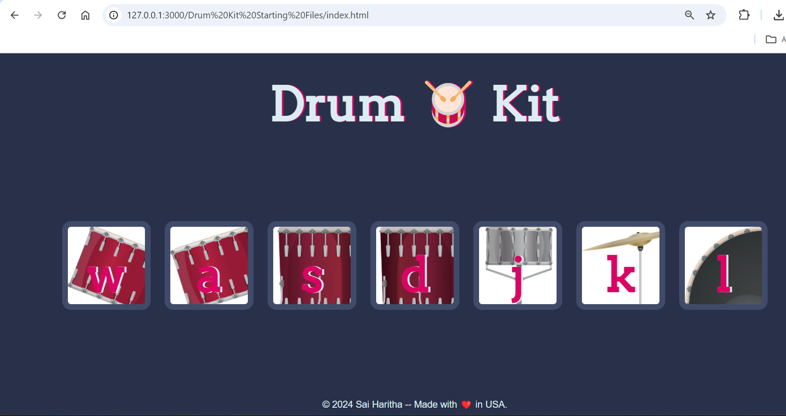

 
  <h1 style="font-size: 36px; font-family: 'Roboto', sans-serif; font-weight: bold;"> 🥁 Drum Kit </h1>

- This project is a simple web-based Drum Kit where users can interact with different drum sounds by clicking on images or pressing specific keys on the keyboard.

### ✨ ***Features***
- "🎵 **Interactive Drum Images**: Users can click on visually appealing drum images to play corresponding sounds."
- "🎹 **Keyboard Support**: Drum sounds can also be triggered by pressing specific keys (`W`, `A`, `S`, `D`, `J`, `K`, `L`)."
- "📱 **Responsive Design**: The layout adjusts to different screen sizes, ensuring a smooth experience across all devices."
- "🎨 **Animations**: Keys are visually animated upon pressing, enhancing the user experience with dynamic feedback."

### ⌨️ ***Key Bindings***

- **W**  : Pressing the W key will play the Tom-1 drum sound.
- **A**  : Pressing the A key will play the Tom-2 drum sound.
- **S**  : Pressing the S key will play the Tom-3 drum sound.
- **D**  : Pressing the D key will play the Tom-4 drum sound.
- **J**  : Pressing the J key will play the Snare drum sound.
- **K**  : Pressing the K key will play the Crash cymbal sound.
- **L**  : Pressing the L key will play the Kick Bass drum sound.

### 🔧 **Technologies Used**
- **HTML**: Structure of the web page.
- **CSS**: Styling and layout, including the responsive design and button animations.
- **JavaScript**: Handles the logic for playing sounds and adding visual effects.

### ⚙️ **How It Works**
1. **Clicking Buttons**: Users can click on drum images to play sounds.
2. **Key Presses**: Users can press the designated keys to trigger corresponding drum sounds.
3. **Animation**: The pressed buttons get a temporary animation to enhance the visual experience.

### 📂 **File Structure**
- `index.html`: The main HTML file that structures the page and contains the drum buttons.
- `styles.css`: Contains the styles for the drum kit, including background images, fonts, colors, and button animations.
- `index.js`: JavaScript file handling the event listeners for button clicks and key presses, playing the appropriate sound, and triggering animations.

### 🚀 **How to Run the Project**
- To set up and run the Drum Kit project on your local machine, follow these steps:
1.	Download or Clone the Repository:
-	You can either download the project files as a ZIP from the repository or use Git to clone the repository:
  
  

2.	Navigate to the Project Directory:
-	Once you have the files, open the terminal and navigate to the project directory:
  
  
  
3.	Open the Project in a Browser:
-	Since the project is built using HTML, CSS, and JavaScript, you can simply open the `index.html` file in any modern web browser:
- If you are using the command line, you can open the file directly:

  

4.	Enjoy Playing the Drum Kit:
-	Once the page loads in your browser, you can interact with the drum kit by either clicking on the images or pressing the keys (`W`, `A`, `S`, `D`, `J`, `K`, `L`) to play different drum sounds.
  
-	No additional setup or dependencies are required, as the project runs purely on client-side web technologies (HTML, CSS, and JavaScript).

### 🎬 **Preview**
**Watch a preview of the Drum Kit in action:**

[Watch the video here](https://drive.google.com/file/d/174owndlacjaMnkfHfxR9Og-1IV1-b9m0/view?usp=sharing)

